<div align="center">

# 🌒 NiZaMinius

<p align="center">
  
</p>


### 🌌 About Me

A developer who believes in the architectural beauty of code and the depth of storytelling.  
Specializing in building complex ecosystems: from high-performance Rust applications to intelligent bots with multi-level memory systems.

[](https://discord.gg/bvUwqJSmFY)
[](https://t.me/NiZaMinius)

</div>

### 🛠 Tech Stack

#### 💻 Programming Languages
[](https://www.rust-lang.org/)
[](https://www.python.org/)
[](https://www.typescriptlang.org/)
[](https://developer.mozilla.org/en-US/docs/Web/JavaScript)

#### 🌐 Frontend & Web
[](https://react.dev/)
[](https://vitejs.dev/)
[](#)
[](#)

* **Architecture:** Modular SPA development with React & Vite, focused on clean component separation and predictable state management.
* **Performance:** Fast bundle assembly, optimized render cycles, and responsive layouts.

#### 🤖 AI, Machine Learning & Backend
[](https://burn.dev/)
[](https://supabase.com/)
[](https://www.postgresql.org/)

* **Native ML & Systems:** Experimenting with custom tokenization and building/training ML models in Rust using the **Burn** framework. Creating AI agents for games trained on data extracted via reverse engineering.
* **Architecture:** Building high-performance Discord integrations in Rust using **serenity**, backed by PostgreSQL/Supabase. Pragmatic architecture without unnecessary Redis overengineering.

<details>
<summary><b>Click to see my AI development & Memory approach</b></summary>

- **Hybrid Memory Pipeline:** 
  - *Short-term:* In-memory (RAM) session context for zero-latency interactions.
  - *Semantic Memory:* Vector embeddings via `pgvector` in Supabase for fast similarity search.
  - *Long-term Memory & RAG:* Tagged event history and lore storage for deep contextual recall spanning weeks or months.
- **Dynamic Personality Engine:** Multi-variable prompt orchestration incorporating internal agent states (mood, fatigue, emotional shifts) to keep character behavior organic and alive.
- **Custom ML Workflows:** Reverse-engineering data pipelines to train autonomous game-playing agents from scratch using Rust-native ML tools.
</details>


### 📊 Activity Stats


<div align="center">

| **Profile Details** | **Most Used Languages** |
| :---: | :---: |
|  |  |


</div>


### ⏳ Weekly Coding Activity 
<!--START_SECTION:wakatime-->


**🐱 My GitHub Data** 

> 📦 576.4 kB Used in GitHub's Storage 
 > 
> 🏆 158 Contributions in the Year 2026
 > 
> 🚫 Not Opted to Hire
 > 
> 📜 15 Public Repositories 
 > 
> 🔑 12 Private Repositories 
 > 
**I'm a Night 🦉** 

```text
🌞 Morning                24 commits          ⣿⣀⣀⣀⣀⣀⣀⣀⣀⣀⣀⣀⣀⣀⣀⣀⣀⣀⣀⣀⣀⣀⣀⣀⣀   05.17 % 
🌆 Daytime                207 commits         ⣿⣿⣿⣿⣿⣿⣿⣿⣿⣿⣿⣀⣀⣀⣀⣀⣀⣀⣀⣀⣀⣀⣀⣀⣀   44.61 % 
🌃 Evening                181 commits         ⣿⣿⣿⣿⣿⣿⣿⣿⣿⣿⣀⣀⣀⣀⣀⣀⣀⣀⣀⣀⣀⣀⣀⣀⣀   39.01 % 
🌙 Night                  52 commits          ⣿⣿⣿⣀⣀⣀⣀⣀⣀⣀⣀⣀⣀⣀⣀⣀⣀⣀⣀⣀⣀⣀⣀⣀⣀   11.21 % 
```
📅 **I'm Most Productive on Friday** 

```text
Monday                   54 commits          ⣿⣿⣿⣀⣀⣀⣀⣀⣀⣀⣀⣀⣀⣀⣀⣀⣀⣀⣀⣀⣀⣀⣀⣀⣀   11.64 % 
Tuesday                  53 commits          ⣿⣿⣿⣀⣀⣀⣀⣀⣀⣀⣀⣀⣀⣀⣀⣀⣀⣀⣀⣀⣀⣀⣀⣀⣀   11.42 % 
Wednesday                83 commits          ⣿⣿⣿⣿⣀⣀⣀⣀⣀⣀⣀⣀⣀⣀⣀⣀⣀⣀⣀⣀⣀⣀⣀⣀⣀   17.89 % 
Thursday                 44 commits          ⣿⣿⣀⣀⣀⣀⣀⣀⣀⣀⣀⣀⣀⣀⣀⣀⣀⣀⣀⣀⣀⣀⣀⣀⣀   09.48 % 
Friday                   106 commits         ⣿⣿⣿⣿⣿⣿⣀⣀⣀⣀⣀⣀⣀⣀⣀⣀⣀⣀⣀⣀⣀⣀⣀⣀⣀   22.84 % 
Saturday                 57 commits          ⣿⣿⣿⣀⣀⣀⣀⣀⣀⣀⣀⣀⣀⣀⣀⣀⣀⣀⣀⣀⣀⣀⣀⣀⣀   12.28 % 
Sunday                   67 commits          ⣿⣿⣿⣿⣀⣀⣀⣀⣀⣀⣀⣀⣀⣀⣀⣀⣀⣀⣀⣀⣀⣀⣀⣀⣀   14.44 % 
```


📊 **This Week I Spent My Time On** 

```text
🕑︎ Time Zone: Asia/Baku

💬 Programming Languages: 
Rust                     5 hrs 27 mins       ⣿⣿⣿⣿⣿⣿⣿⣿⣿⣿⣿⣿⣿⣿⣿⣿⣿⣿⣿⣿⣿⣿⣿⣿⣿   99.54 % 
Markdown                 1 min               ⣀⣀⣀⣀⣀⣀⣀⣀⣀⣀⣀⣀⣀⣀⣀⣀⣀⣀⣀⣀⣀⣀⣀⣀⣀   00.46 % 

🔥 Editors: 
Zed                      5 hrs 29 mins       ⣿⣿⣿⣿⣿⣿⣿⣿⣿⣿⣿⣿⣿⣿⣿⣿⣿⣿⣿⣿⣿⣿⣿⣿⣿   100.00 % 

🐱‍💻 Projects: 
wireworld                5 hrs 27 mins       ⣿⣿⣿⣿⣿⣿⣿⣿⣿⣿⣿⣿⣿⣿⣿⣿⣿⣿⣿⣿⣿⣿⣿⣿⣿   99.54 % 
mira-engine              0 secs              ⣀⣀⣀⣀⣀⣀⣀⣀⣀⣀⣀⣀⣀⣀⣀⣀⣀⣀⣀⣀⣀⣀⣀⣀⣀   00.29 % 
Unknown Project          0 secs              ⣀⣀⣀⣀⣀⣀⣀⣀⣀⣀⣀⣀⣀⣀⣀⣀⣀⣀⣀⣀⣀⣀⣀⣀⣀   00.17 % 

💻 Operating System: 
Windows                  5 hrs 29 mins       ⣿⣿⣿⣿⣿⣿⣿⣿⣿⣿⣿⣿⣿⣿⣿⣿⣿⣿⣿⣿⣿⣿⣿⣿⣿   100.00 % 
```

🤖 **AI Coding This Week** 

```text
No AI Coding Activity Tracked This Week
```

**Timeline**


 Last Updated on 29/08/2026 06:22:28 UTC
<!--END_SECTION:wakatime-->


### 🔮 Current Focus
- 🦀 Deep diving into systems programming with **Rust**.
- 🧠 Optimizing contextual memory for AI agents.
- 🎨 Crafting atmospheric interfaces using modern web technologies.


<div align="center">
  
</div>
