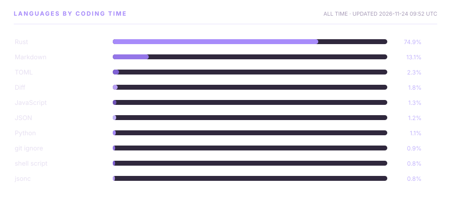
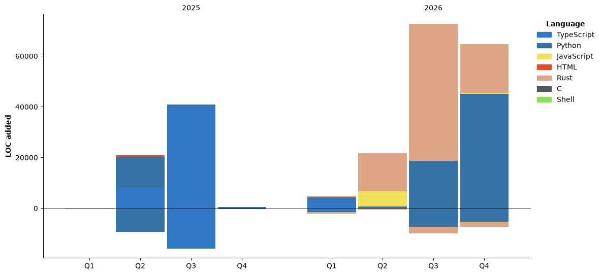

# 🌒 NiZaMinius

  

  

## About Me

Software developer focused on Rust and developer tooling. I build CLI/TUI applications and reusable libraries, with an emphasis on flexibility, safety, and performance. I'm particularly interested in systems programming, low-level concepts, software architecture, and improving existing solutions.

I also build integrations for local and hosted language models, including retrieval-augmented generation (RAG), tool calling, and database-backed multi-layer memory systems.

  
  

## Interests

- Systems programming and low-level software
- Software architecture and system design
- Performance optimization and improving existing solutions

## Projects

<b>tree2dir</b> — Turn text-based directory trees into real files and directories

A flexible Rust CLI/TUI utility that converts a text representation of a directory tree into actual files and directories.

**Highlights**
- Interactive TUI, Unix pipes, and file-based input.
- Handles box-drawing characters, spaces, tabs, and raw `tree` output with Unicode-aware indentation parsing.
- Detects directories from their structure instead of requiring every directory to be marked manually.
- Includes path-traversal protection, safe handling of existing files, and a `--dry-run` mode.
- Distributed as a self-contained binary.

**Stack:** Rust, Ratatui, Crossterm.

<b>GameMaker-Save</b> — Encrypted save system for GameMaker Studio 2

A cross-platform save system for GameMaker Studio 2, built around a Rust core and exposed to GameMaker through a C ABI layer.

**Highlights**
- XChaCha20-Poly1305 authenticated encryption.
- PBKDF2-HMAC-SHA256 key derivation and fallback-key rotation.
- Atomic writes to help protect existing save slots from interrupted writes.
- Independent save slots, metadata access, backups, and import/export operations.
- Builds for Windows, Linux, and macOS.

**Stack:** Rust, C ABI / FFI, XChaCha20-Poly1305, PBKDF2-HMAC-SHA256, GameMaker.

<b>Entropix</b> — Real-time activity and chaos tracking for Discord

A collaborative Rust Discord bot that estimates channel activity using a heuristic chaos index based on message velocity, capitalization, and punctuation density. When activity crosses configured thresholds, the bot can rename the monitored channel and produce daily activity summaries.

**My contribution:** Implemented the core application logic and database layer, and handled a substantial part of the bug fixing. The project architecture and file structure were developed together with [Devoid-Kun](https://github.com/Devoid-Kun). The mathematical model and documentation were contributed by Devoid-Kun.

**Stack:** Rust, Serenity, Poise, Tokio, SQLx, SQLite.

## Tech Stack

<b>Languages, Libraries & Tools</b>

<table align="center">
  <tr>
    <td width="175"><b>Languages</b></td>
    <td>
      
      
      
      
       
      Rust is my primary language.
    </td>
  </tr>
  <tr>
    <td><b>CLI & TUI</b></td>
    <td>
      
      
      
      
    </td>
  </tr>
  <tr>
    <td><b>Async & Discord</b></td>
    <td>
      
      
      
    </td>
  </tr>
  <tr>
    <td><b>Python Libraries</b></td>
    <td>
      
      
      
      
      
      
      
      
      
    </td>
  </tr>
  <tr>
    <td><b>Data & Serialization</b></td>
    <td>
      
      
      
      
    </td>
  </tr>
  <tr>
    <td><b>Errors & Logging</b></td>
    <td>
      
      
      
      
    </td>
  </tr>
  <tr>
    <td><b>Databases & Backend</b></td>
    <td>
      
      
      
       
      
    </td>
  </tr>
  <tr>
    <td><b>Machine Learning</b></td>
    <td>
      
    </td>
  </tr>
  <tr>
    <td><b>Cryptography</b></td>
    <td>
      
      
      
      
    </td>
  </tr>
  <tr>
    <td><b>Interoperability & APIs</b></td>
    <td>
      
      
      
    </td>
  </tr>
  <tr>
    <td><b>Frontend · Previous experience</b></td>
    <td>
      
      
      
    </td>
  </tr>
  <tr>
    <td><b>Testing</b></td>
    <td>
      
      
      
      
    </td>
  </tr>
</table>

## Coding Statistics

<b>⌛ Coding Statistics</b>

  <!-- Generated by the WakaTime stats workflow. -->
  

### Languages by coding time · All time

  

### Languages in repositories · GitHub

  

### Code changes by quarter · GitHub

<!--START_SECTION:github-loc-->
**Timeline**

<!--END_SECTION:github-loc-->

## GitHub Activity

  

  

